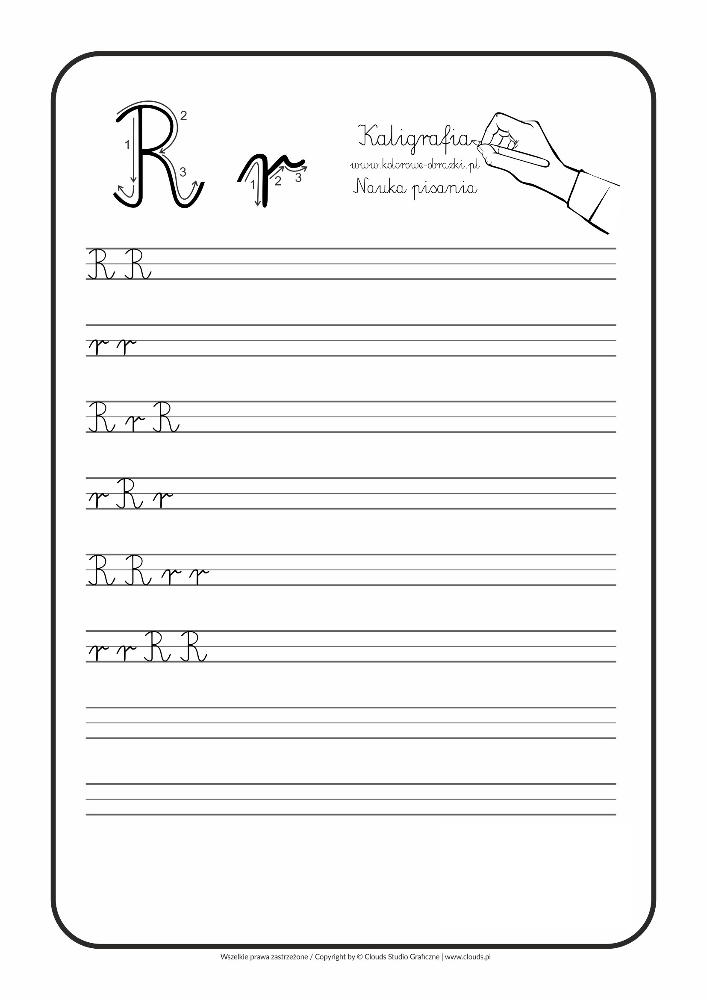

## Wczytanie danych

Do **R** można wczytywać dane na wiele sposobów, my skorzystamy z funkcji **read.csv**.

Najpierw warto sprawdzić jaki katalog jest ,,domyślny'' i w razie potrzeby zmienić go na inny za pomocą funkcji **setwd()**.

```{r}
data <- read.csv("dane/german_credit_data.csv", 
                       encoding = "UTF-8")
```

Do zmiennej *data* przypisaliśmy wynik funkcji *read.csv*.


## Obiekty

```{r}
# wymiary tabeli
dim(data)

# pierwsze wiersze z tabeli
##data[1:4,1:11]
head(data)
```


## Co to za dane?


##
**German credit data** dotyczą klientów banku i oceny ich zdolności kredytowej. Występujące zmienne:

- X - liczba porządkowa,
- Age - wiek w latach,
- Sex - płeć,
- Job - rodzaj pracy, gdzie wyższa liczba oznacza wyższy stopień wykwalifikowania,
- Housing - mieszkanie własne, czynszowe, bądź bezczynszowe,
- Saving accounts - im więcej, tym wyższa wartość konta oszczędnościowego/obligacji,

##
- Credit amount - kwota kredytu w markach niemieckich,
- Duration - czas trwania (w miesiącach),
- Purpos - przeznaczenie kredytu,
- Risk - klient dobry/zły.


## Czy typy się zgadzają?
```{r}
sapply(data, class)
```

##Przekodowane?
```{r}
data2<-data
data2$Job <- factor(x = as.character(data$Job), 
                   labels = 
                     c('unskilled and non-resident', 
                       'unskilled and resident',
                       'skilled','highly skilled'))
head(data2$Job)
```

## Ćwiczenie 1
Zapropononuj inne modyfikacje, utworzenie cech lub usuniecie cech w ramce danych. Można np. użyć funkcji **as.numeric**, żeby przekonwertować tekst na wartości liczbowe.




## Przykład rozwiązania
```{r}
data2$Risk<-as.numeric(x=data$Risk,labels=c(1,2))
head(data2$Risk)#1-bad, 2-good
```


## Obiekty

```{r}
# podsumowanie tabeli
summary(data2)
```


## 
Zwykle można zrobić to też inaczej:
```{r}
# podsumowanie tabeli
library(funModeling)
```
##
```{r}
funModeling::df_status(data2)
```


##Interfejs w RStudio 


##Przeglądanie danych
Przy niedużych zbiorach danych możemy w łatwy sposób poznać strukturę:


##Podstawowe zależności
```{r, message=FALSE, warning = FALSE}
pairs(data[,c(1,8,9)])
```

##Braki w danych, poprawność
Istnieje wiele podejść do tego tematu, np. zastąpienie konkretną wartością, zastąpienie jakąś z agregacji, pominięcie rekordów lub skorzystanie z predykcji. Istnieją pakiety do obróbki brakujących danych, np. **mitools.**
```{r, message=FALSE, warning = FALSE}
data2<-na.omit(data)
head(is.na(data))
```


##Przeglądanie większych zbiorów danych
**SQL**? Warto spróbować!
```{r, message=FALSE, warning = FALSE}
library(sqldf)
zapytanie1<-"select Age, Sex, Risk 
from data2 
order by Age desc 
limit 5" 
sqldf(zapytanie1)
```
##Wczytywanie konkretnych wyników
```{r, message=FALSE, warning = FALSE}
zapytanie0<-read.csv.sql("dane/german_credit_data.csv",
sql = "select Age, Sex, Risk 
from file order by Age desc limit 5") 
print(zapytanie0)
```
##Przykładowe agregacje
Średni wiek ,,złych'' mężczyzn...
```{r, message=FALSE, warning = FALSE}
zapytanie2 = "select avg(Age) as sredni_wiek from data2 where Sex='male' and Risk=1" 
sqldf(zapytanie2)
```
##Ćwiczenie 2
Podaj średnią  kwotę kredytu w markach niemieckich dla kobiet, które są ,,dobrymi klientami''.
```{r}
zapytanie3 = 'select avg("Credit.amount") as [Kwota kredytu] from data2 where Sex="female" and Risk=2'
sqldf(zapytanie3)
```

##Gruopowanie
Połączenie poprzednich ćwiczeń:
```{r}
zapytanie4 = 'select Sex,Risk, avg(Age) as [Wiek], avg("Credit.amount") as [Kwota kredytu] from data2 group by Sex,Risk'
sqldf(zapytanie4)
```


##Pakiet dplyr
Jeden z popularniejszyh pakietów do przetwarzania danych.
```{r, message=FALSE, warning = FALSE}
library(dplyr)
```
